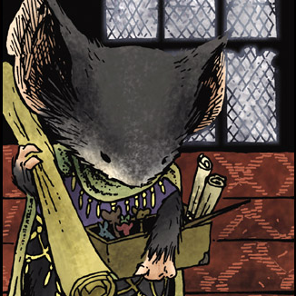

# Landra

> Landra was a member of the Guard and at one point the quartermaster for the Guard's equipment. As of the winter of 1152, following Rand's grim injuries, Landra was promoted by Gwendolyn to the rank of Captain of Lockhaven's Defenses: a job which required her to track the movements and the expected arrivals and departures of Guardmice on their various patrols. Being incredibly pragmatic and organised, she made a natural replacement for Rand.

**Landra is a simple event management bot for Discord written in Discord.js.**

## To-Do
- [x] Add the ability to update events
- [x] Add a task that checks if events are happening and posts notices
- [x] Add recurring events
- [ ] Roles?
- [x] Configuration for roles that can manage events
- [x] Daily reminders
- [x] Time offsets
- [x] Add checks for no events
- [x] Add checks for text channel groups
- [x] Pick a colour
- [x] Add permission checks
