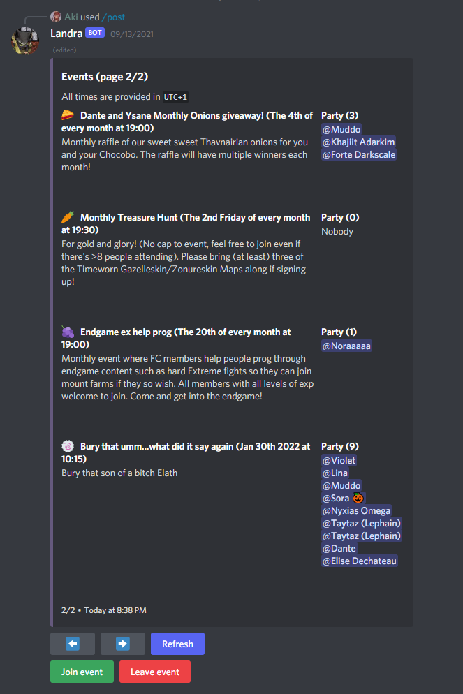

# Commands

Here is a list of all available commands. All commands are availabel to members with the `Administrator` permission. The following commands are available to roles that have been configured to manage events:
- `/post`
- `/schedule`
- `/remove`
- `/update`

#### Arguments
Command arguments are denoted `argument:`.

All arguments that come before the `|` symnol are required, the ones after are optional.

# Event commands

## Post
This command posts the events list. This will be the primary way users interact with the bot.



## Schedule
This command schedules new events.

#### Usage
```discord
/schedule name: date: description:  |  recurring:
```

- `name` is the name for the event.
- `date` is when the event will first take place. The date format is `YYYY/MM/DD hh:mm`.
- `description` is the description for the event.
- `recurring` dictates how often the event should repeat. If this argument is not supplied, the event will only happen once.

#### Note
You will have to refresh the events list to see the new event.


## Remove
This command removes an event.

#### Usage
```discord
/remove
```

Once executed, the bot will give you a list of events that are available to remove.


#### Note
You will have to refresh the events list to see the new event.


## Update
This command allows you to update an event's description, name, date or change how often it recurs.

#### Usage
```discord
/update | name: description: date: recurring:
```
- `name` is the name for the event
- `date` is when the event will first take place. The date format is `YYYY/MM/DD hh:mm`
- `description` is the description for the event
- `recurring` dictates how often the event should repeat. If this argument is not supplied, the event will only happen once.

Once you have executed the command, the bot will let you pick which event you want to apply the changes to.


#### Note
You will have to refresh the events list to see the new event.


## Purge
This command will remove you from all events scheduled with this bot.

#### Usage
```discord
/purge
```

#### Note
This command will erase all your entries in the bot's database. This will affect events in **ALL GUILDS**!


# Config commands

## Config print
This command prints the current configuration for the guild.

#### Usage
```discord
/config print
```

#### Note
This command is only available to members with the `Administrator` permission.


## Config channel
This command configures which channels receive event and daily notifications.

#### Usage
```discord
/config channel action: channel: type:
```
- `action` whether to set or unset the channel type.
- `channel` the channel to configure.
- `type` a choice of daily notifications or event notifications.

#### Daily notifications
Daily notifications are an overview of of which events are happening that day. Daily notifications are posted every morning at `10:00`.

#### Event notifications
Event notifications are posted an hour before and when events are scheduled to happen.

#### Note
This command is only available to members with the `Administrator` permission.


## Config role

This command configures which roles can execute the `/schedule`, `/update` and `/remove` commands.

#### Usage
```discord
/config role action: role:
```
- `action` whether to allow or disallow the role to manage events.
- `role` the role to configure

#### Note
This command is only available to members with the `Administrator` permission.


## Config time
This command configures the guild's time offset. (e.g. `UTC+5`)

```discord
/config time offset:
```
- `offset` is the time offset to set for your guild

#### Note
This command is only available to members with the `Administrator` permission.
