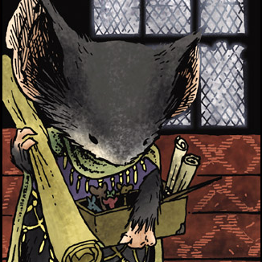
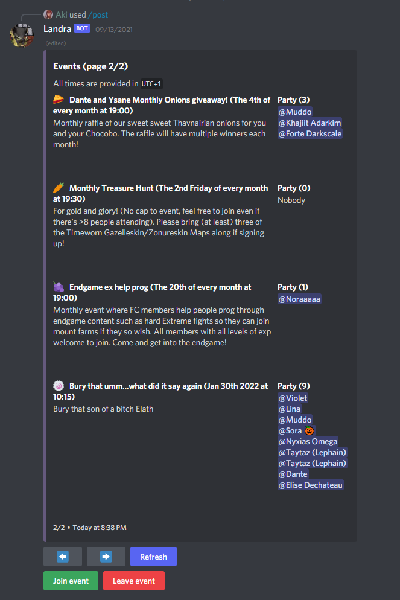
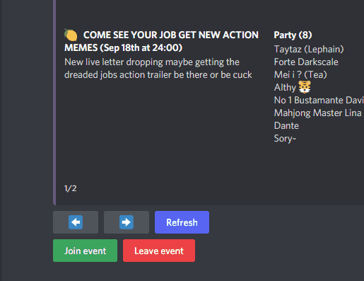
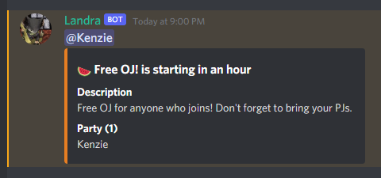

# About Landra



> Landra was a member of the Guard and at one point the quartermaster for the Guard's equipment. As of the winter of 1152, following Rand's grim injuries, Landra was promoted by Gwendolyn to the rank of Captain of Lockhaven's Defenses: a job which required her to track the movements and the expected arrivals and departures of Guardmice on their various patrols. Being incredibly pragmatic and organised, she made a natural replacement for Rand.

**Landra is a simple event management bot for Discord written in Discord.js.**

Any questions or concerns, please contact `@utvarp` on Discord.

## Features
- A simple, easy to use, user interface
- Easy to set up
- A clean, organised overview of all events and the people who have signed up
- A customisable time offset (`UTC+/-N`)
- Notifications when events start
- Events can be scheduled as one-time, daily, weekly or monthly
- Event announcement widgets
- Cute emojis!
- Integration with guild events

## Getting started
After inviting Landra to your guild, run
```discord
/post
```
which will post a list of all scheduled events. Members can interact with this list to join and leave events.

You can configure which roles can manage events and which channels will receive event notifications with the [`/config`](commands#config) command.


## Screenshots
### Events list


### Joining


### Notifications


